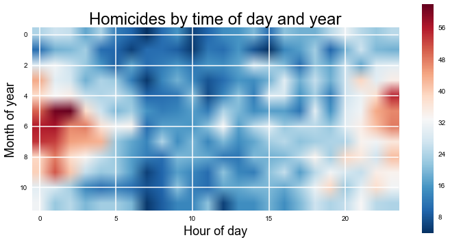
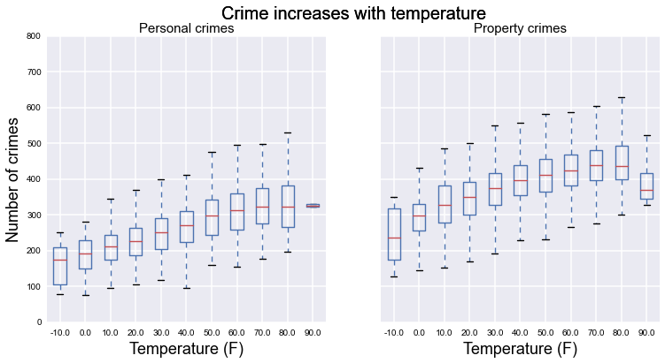
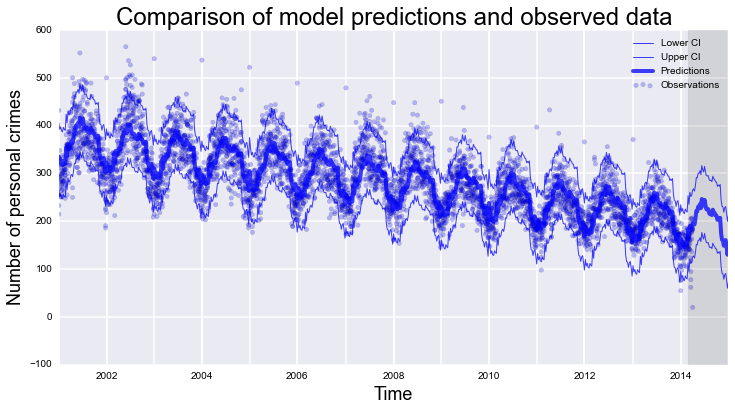
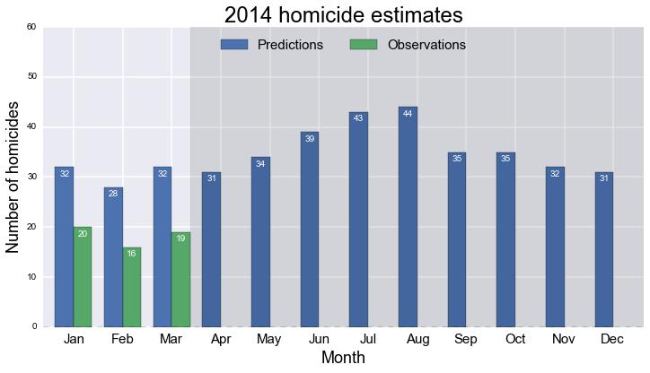
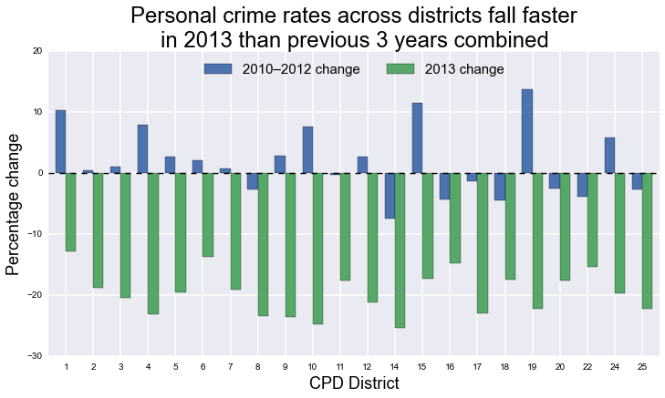
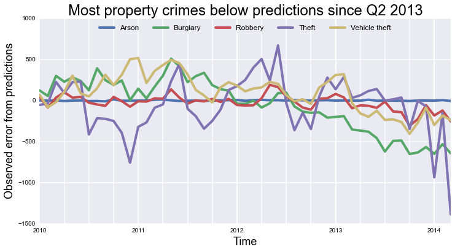

WeatherCrime
============

**Can we attribute a fall in violent crime in Chicago to its new conceal and carry laws?** This was the argument many conservative blogs and news outlets were making in early April after statistics were released showing a marked drop in the murder rate in Chicago. These articles attributed "Chicago's first-quarter murder total \[hitting\] its lowest number since 1958" to the deterrent effects of Chicago's concealed and carry permits being issued in late February \([RedState](http://www.redstate.com/2014/04/04/chicagos-murder-rate-plummets-concealed-carry-law/)\). Other conservative outlets latched onto the news to argue the policy "is partly responsible for Chicago's across-the-board drop in the crime" \([TheBlaze](http://www.theblaze.com/stories/2014/04/04/gun-control-advocates-who-say-more-guns-equal-more-crime-might-not-want-to-read-this/)\) or that the policy contributed to the "murder rate promptly \[falling\] to 1958 levels" \([TownHall](http://townhall.com/tipsheet/christinerousselle/2014/04/04/chicago-enacts-concealed-carry-murder-rate-promptly-falls-to-1958-level-n1818843)\). 

Several articles hedged about the causal direction of any relationship and pointed out that this change is hard to separate from falling general crime rates as well as the atrocious winter weather this season \([PJMedia](http://pjmedia.com/tatler/2014/04/06/can-we-credit-the-new-conceal-carry-law-in-chicago-for-reduced-homicide-rate/), [Wonkette](http://wonkette.com/545814/the-gun-fondlers-save-chicago-and-more-news-in-your-gun-fun-times-roundup), [HuffPo](http://www.huffingtonpost.com/2014/04/01/chicago-homicide-rate-2014_n_5070438.html)\) The central claim here is whether the adoption of the conceal and carry policy in March 2014 contributed to significant changes in crime rates rather than other social, historical, or environmental factors. 

However, an April 7 [feature story](http://www.chicagomag.com/Chicago-Magazine/May-2014/Chicago-crime-rates/) by David Bernstein and Noah Isackson in *Chicago* magazine found substantial evidence of violent crimes like homicides, robberies, burglaries, and assaults being reclassified, downgraded to more minor crimes, and even closed as noncriminal incidents. They argue that after Police Superintendent Garry McCarthy arrived in May 2011, the drop in crime has improbably plummeted in spite of high unemployment and significant contraction in the Chicago Police Department's beat cops. An audit by Chicago's inspector general into these crime numbers suggests assaults and batteries may have been underreported by more than 24%. This raises a second question: **can we attribute the fall in violent crime in Chicago to systematic underreporting of criminal statistics?**

In this post, I do four things:

* First, I demonstate the relationship crime has with environmental factors like temperature as well as temporal factors like the hour of the day and day of the week. I use a common technique in signal processing to identify that criminal activity not only follows an annual pattern, but also patterns by day of the week.

* Second, I estimate a simple statistical model based on the findings above. This model combines temperature, the day of the week, the week of the year, and longer-term historical trends and despite its simplicity (relative to more advanced types of time series models that could be estimated), does a very good job explaining the dynamics of crime in Chicago over the past 13 years.

* Third, I use this statistical model to make predictions about crime rates for the rest of 2014. If there's a significant fall-off in violent crime following the introduction of the conceal and carry policy in March 2014, this could be evidence of its success as a deterrent (or that this is a bad model). But if the actual crime data matches the model's forecasted trends, it suggests the new conceal and carry policy has had no effect. There are no findings here as yet, but I expect as the data comes in there will be no significant changes after March 2014.

* Fourth, I find evidence of substantial discrepancies in the reporting some crime data since 2013. This obviously imperils the findings of the analyses done above, but also replicates the findings reported by Bernstein and Isackson. The statistical model above expected that property crimes such as arson, burglary, theft, and robbery should follow a particular pattern, which the observed data significantly deviates from after 2013. I perform some additional analyses to uncover which crimes and reporting districts are driving this discrepancy as well as how severe this discrepancy is.

